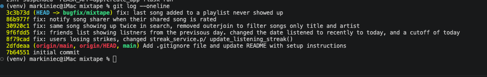

## AI
Copilot was used once, early on, to suggest a starting format for the codebase map table.

Claude Code was used throughout codebase navigation and debugging, with specific asks per issue rather than one general "fix the bugs" request:
- Asked Claude to explain, in general, how to reproduce a bug professionally before fixing it (get a precise expected-vs-actual statement, find the smallest deterministic trigger, prefer an automated repro over a manual one) — then applied that method to each of the 5 reported issues individually, e.g. running `pytest tests/test_streaks.py -v` to reproduce Issue #1's Sunday-only reset with fixed `datetime` objects instead of waiting for a real Sunday.
- For each issue, asked Claude to read the relevant `services/` file, trace how the reported symptom mapped to specific code (e.g. `RECENT_THRESHOLD = timedelta(hours=24)` for Issue #2, `songs[:-1]` for Issue #5), and propose a fix scoped to only that line/condition rather than a broader rewrite.
- Asked Claude to write regression tests for the two modules that had no existing coverage (`tests/test_feed.py` for Issue #2, `tests/test_notifications.py` for Issue #4), and then to prove — not just assert — that one of them would have caught its bug: Claude used `git stash` to temporarily remove the Issue #4 fix, reran the test and showed it failing (`assert 0 == 1`), then restored the fix and reran it passing.

**Where I had to verify/course-correct Claude's output:** while investigating Issue #3 (duplicate search results), Claude's initial explanation was that the missing `.distinct()` on the `song_tags` join would cause `tests/test_search.py::test_search_no_duplicates_multi_tag_song` to fail before the fix. When Claude actually ran that test, it passed even on the unfixed code — contradicting the explanation. Rather than accepting that as "no bug here," I had Claude dig further; it compared a raw SQL row count against the ORM's `.all()` result directly and found SQLAlchemy was silently de-duplicating the rows on its own, meaning the join defect was real (confirmed at the SQL level) but the existing automated test wasn't reliable evidence for it. I made sure that caveat — that this fix isn't demonstrated by a failing-then-passing test the way the others are — is called out explicitly in the Issue #3 entry above, instead of letting the passing test imply stronger proof than it actually gave.

 ---

## Codebase map
```
mixtape/
├── app.py                      # Flask application factory; configures SQLAlchemy, registers blueprints, and initializes the application
├── routes/                     # API endpoints organized into Flask blueprints
│   ├── songs.py                # Song sharing, search, and rating routes
│   ├── playlists.py            # Playlist creation and song management
│   ├── users.py                # User profiles, streaks, notifications
│   └── feed.py                 # Friends listening now, activity feed
├── services/
│   ├── streak_service.py       # Listening streak logic
│   ├── feed_service.py         # Friends listening now feed logic
│   ├── search_service.py       # Song search logic
│   ├── notification_service.py # Notification creation and retrieval
│   └── playlist_service.py     # Playlist retrieval logic
├── tests/
│   ├── test_streaks.py         # Tests for streak functionality
│   ├── test_search.py          # Tests for search functionality
│   └── test_playlists.py       # Tests for playlist functionality

├── seed_data.py                # Populates DB with test data
|__ models.py                   # SQLAlchemy database models and schema definitions
├── requirements.txt            # Project dependencies
|__ submission.md               # Contains submission for project
└── .gitignore                  # Files and directories excluded from version control

```

| Component | Description |
|--------|--------|
| `app.py` | Flask application factory — configures SQLAlchemy, registers the four route blueprints, and creates the database tables. |
| `routes/` | Flask blueprints that handle incoming HTTP requests: parse input, call the matching `services/` function, and return a JSON response. Routes never touch the database directly. |
| `routes/songs.py` | Song search, single-song lookup, rating, and listen-event requests. Delegates to `search_service.py`, `notification_service.py`, and `streak_service.py`. |
| `routes/playlists.py` | Playlist creation, playlist/song lookup, and add-song-to-playlist requests. Delegates to `playlist_service.py` and `notification_service.py`. |
| `routes/users.py` | User profile, streak, and notification requests. Delegates to `streak_service.py` and `notification_service.py`. |
| `routes/feed.py` | "Friends listening now" and general activity feed requests. Delegates to `feed_service.py`. |
| `services/` | Contains all business logic used by the route handlers. |
| `services/streak_service.py` | Records listening events and calculates/updates each user's listening streak. |
| `services/feed_service.py` | Builds the "friends listening now" list and the general activity feed from `ListeningEvent` records. |
| `services/search_service.py` | Searches songs by title/artist and fetches a single song by id. |
| `services/notification_service.py` | Creates and retrieves notifications; also handles adding a song to a playlist and rating a song, since both actions can trigger a notification. |
| `services/playlist_service.py` | Creates playlists and retrieves a playlist's songs in order. |
| `models.py` | SQLAlchemy models and association tables: `User`, `Song`, `Tag`, `Playlist`, `ListeningEvent`, `Rating`, `Notification`, plus the `friendships`, `song_tags`, and `playlist_entries` join tables. |
| `tests/` | Pytest suite, one file per service module, run against an in-memory SQLite database. |
| `seed_data.py` | Populates the database with realistic sample users, songs, playlists, and listening events for manual testing. |
| `requirements.txt` | Project dependencies (Flask, Flask-SQLAlchemy, SQLAlchemy, pytest). |
| `submission.md` | This submission document. |
| `.gitignore` | Files and directories excluded from version control. |

### Data flow

**Adding a song to a playlist, end to end:** `POST /playlists/<playlist_id>/songs` is handled by `add_song()` in `routes/playlists.py`, which parses `song_id`/`added_by` from the request body and calls `services/notification_service.add_to_playlist()`. That function looks up the `Song`, `User`, and `Playlist` rows, inserts a row into the `playlist_entries` association table, and — if the song wasn't added by the person who originally shared it — calls `create_notification()` to write a `Notification` row for the sharer. That notification only becomes visible later, through a completely different route: `GET /users/<user_id>/notifications` in `routes/users.py`, which calls `services/notification_service.get_notifications()`. So one write request touches two tables (`playlist_entries` and `notification`) through a single service function, and the result surfaces through an unrelated endpoint.

**Populating the "Friends Listening Now" feed:** there's no dedicated feed table — it's a live query. Every time a user plays a song, `POST /songs/<song_id>/listen` in `routes/songs.py` calls `services/streak_service.record_listening_event()`, which inserts a row into `ListeningEvent` (and updates the user's streak as a side effect). Later, `GET /feed/<user_id>/listening-now` in `routes/feed.py` calls `services/feed_service.get_friends_listening_now()`, which queries `ListeningEvent` for the user's friends, filters to today, and joins back to `User` and `Song` to build the response. The feed is just a read over the same `ListeningEvent` table the streak logic writes to.


## How you reproduced it
<!-- what inputs, what sequence of actions, or what data condition triggered the behavior -->

### Issue #1 -  My listening streak keeps resetting
- To reproduce bug: 
    - the error code line is in streak_service.py at line 73, `today.weekday() != 6`
    - the data condition that triggers the behavior is`Sunday date`. 
    - call update_listening_streak(user, saturday_dt) then update_listening_streak(user, sunday_dt) with fixed datetime objects and assert the streak.
    - pytest tests/test_streaks.py -v — this test fails today (1 == 2 assertion error)
- Expected: streak goes from 12 to 13. 
- Actual: streak shows 1.
 
### Issue #2 — Friends Listening Now shows people from yesterday
- To reproduce bug: 
    - the error code is in feed_service.py, `RECENT_THRESHOLD = timedelta(hours=24)`
    -  the data condition that triggers the behavior  `2+ tag join fan-out`
1. Find nova's id: sqlite3 mixtape.db "select id from user where username='nova';"
2. GET /feed/<nova>/listening-now
3. Observe friends whose only event is the 10h/18h-ago one still show up as "listening now" — those easily correspond to "yesterday evening" depending on when you run it, matching the report. 
- Expected: only genuinely-today listens should appear.
- Actual: friends whose last listen was yesterday evening still show up the next morning.

### Issue #3 — The same song keeps showing up twice in search
- To reproduce bug:
    - the error code is in search_service.py, .outerjoin(song_tags, ...) with no `.distinct()`
    -  the data condition that triggers the behavior `multi-tag song`
1. GET /songs/search?q=Anthem
2. Count entries for "Crown Heights Anthem" in results — expect 1, the join fans out one row per tag so a 3-tag song returns 3 identical entries. A song with 0 or 1 tags won't duplicate (only 1 join row), which is exactly the "inconsistent" behavior described — worth confirming the count yourself since it depends on how many tags the matched song has.
- Expected: each matching song appears exactly once. 
- Actual: some songs appear once, others two or three times, for a single-song match.


### Issue #4 - I got notified when a friend added my song to a playlist but not when they rated it
- To reproduce bug:
    - the error code is in notification_service.py
    - the data condition that triggers the behavior `rating vs. playlist-add code path`
1. Get a seeded song shared by nova and nova's id (recipient), plus another user's id (e.g. darius) as rater.
2. POST /songs/<song_id>/rate {"user_id": darius_id, "score": 5} — confirm 201 and the rating is saved.
3. GET /users/<nova_id>/notifications — expect a new rating notification; you'll only see the pre-seeded "song_added_to_playlist" one (seed_data plants exactly one working notification as your control/baseline for comparison — see its comment # so students can see the correct pattern when investigating Issue #4).
- Expected: a notification for the rating, same as for the playlist add. 
- Actual: rating is saved (it shows on the song), but no notification is ever created.


### Issue #5 — The last song in a playlist never shows up
- To reproduce bug:
    - the error code is in playlist_service.py line66
    - the data condition that triggers the behavior `last-position slice`
1. sqlite3 mixtape.db "select id from playlist where name='Friday Energy';"
2. GET /playlists/<playlist_id>/songs — expect count: 7, get count: 6.
3. POST /playlists/<playlist_id>/songs {"song_id": <some_other_song_id>, "added_by": <darius_id>}
4. GET /playlists/<playlist_id>/songs again — the previously-missing 7th song now appears, and the just-added 8th is now the one missing. Confirms it's always truncating the last-by-position entry, not a specific song.


Expected: every song in the playlist is returned, including the newest. Actual: the most recently added song is always missing; adding another song "frees" the previous one and hides the new one instead.


## Root Cause Analysis

### Issue #1 — My listening streak keeps resetting

**1. Issue number and title**
Bug Issue #1, "My listening streak keeps resetting."

**2. Reproduction steps**
- Located the branch in `services/streak_service.py:73`: `elif days_since_last == 1 and today.weekday() != 6: user.listening_streak += 1` (else reset to 1).
- Called `update_listening_streak(user, saturday_dt)` then `update_listening_streak(user, sunday_dt)` with fixed `datetime` objects for a Saturday and the following Sunday.
- Ran `pytest tests/test_streaks.py -v`: `test_streak_increments_on_sunday` failed with `assert 1 == 2` — the streak reset to 1 instead of incrementing to 2, reproducing the report deterministically without needing to wait for a real Sunday.

**3. Navigation strategy**
Went to `services/streak_service.py` since the report was specifically about the listening streak. Read the docstring for `update_listening_streak`, which states only four rules (first listen → 1, same day → no change, consecutive day → +1, gap → reset to 1) with no day-of-week exception. Scanning the function body against that spec, the extra `and today.weekday() != 6` clause on the "consecutive day" branch stood out immediately as not matching the documented behavior — that mismatch was the moment of confidence that this was the bug.

**4. Root cause explanation**
`days_since_last == 1` correctly detects a consecutive-day listen, but the added `and today.weekday() != 6` condition (Python's `weekday()` numbers Monday=0..Sunday=6) makes the increment only fire when today isn't a Sunday. On a Sunday the whole `elif` evaluates `False`, so execution falls through to the `else` branch and the streak resets to 1 even though no day was actually skipped.

**5. Fix description**
Removed the `and today.weekday() != 6` clause entirely, leaving `elif days_since_last == 1: user.listening_streak += 1`. Consecutive-day listens now increment regardless of the day of week, matching the documented rule.

**6. Side-effect check**
Ran all 5 cases in `tests/test_streaks.py` (new user, same-day, consecutive-day, skipped-day, Sunday) — all passed. Grepped `services/`, `routes/`, and `models.py` for other references to `weekday()`, `listening_streak`, and `last_listened_at` to confirm no other code path depended on the old Sunday-specific behavior — none found. Ran the full suite (`pytest tests/`) to confirm no cross-file regressions.

---

### Issue #2 — Friends Listening Now shows people from yesterday

**1. Issue number and title**
Bug Issue #2, "Friends Listening Now shows people from yesterday."

**2. Reproduction steps**
- Using seed data, `darius`, `simone`, and `kenji` have `ListeningEvent` rows 10–20 minutes old, plus older ones at 2, 10, 18, 26+ hours old.
- Looked up nova's id and called `GET /feed/<nova_id>/listening-now`.
- Observed friends whose only event was 10–18 hours old (i.e., the previous evening, from a morning check) still appearing in the "listening now" results — matching nova's report about darius.

**3. Navigation strategy**
Went to `services/feed_service.py` since the report was about the "Friends Listening Now" feature. Found `RECENT_THRESHOLD = timedelta(hours=24)` used to build the query's `cutoff`. Worked out the timeline from the bug report (11pm listen, still visible at 9am — about 10 hours later) and confirmed 10 hours sits well inside a 24-hour window, which is exactly why the stale event still passed the filter.

**4. Root cause explanation**
`cutoff = datetime.now(timezone.utc) - RECENT_THRESHOLD` computes a *rolling* 24-hour window from the moment of the request, not a calendar-day boundary. An event from 11pm the previous night is only ~10 hours old at 9am the next morning, so it still passes `listened_at >= cutoff`, even though it happened "yesterday" from the user's point of view. The correct behavior requires a fixed boundary (start of today), not a fixed duration.

**5. Fix description**
Replaced the rolling window with a start-of-day cutoff: `cutoff = datetime(now.year, now.month, now.day, tzinfo=timezone.utc)`. Removed the now-unused `RECENT_THRESHOLD` constant and `timedelta` import.

**6. Side-effect check**
Added `tests/test_feed.py` (no coverage existed before) with 3 cases: a friend who listened at 11pm the previous day is excluded, a friend who listened just after midnight today is included, and a user with no friends still returns `[]`. All 3 passed. Ran the full suite — no regressions in the other three modules.

---

### Issue #3 — The same song keeps showing up twice in search

**1. Issue number and title**
Bug Issue #3, "The same song keeps showing up twice in search."

**2. Reproduction steps**
- Called `GET /songs/search?q=Anthem` against seed data, where "Crown Heights Anthem" has 3 tags.
- To pin down the mechanism precisely, ran the underlying SQL directly against an in-memory SQLite DB outside the ORM: the raw join returned 3 rows for the 3-tag song, confirming the fan-out at the SQL level.

**3. Navigation strategy**
Went to `services/search_service.py` since the report was about search results. Read `search_songs()` and noticed it joins `Song` to `song_tags` via `.outerjoin(...)`, but the `WHERE` clause only filters on `Song.title`/`Song.artist` — the join isn't used for filtering at all, which was the first clue it existed only to (unintentionally) fan out rows. Confirmed the fan-out by comparing a raw SQL row count (3, for the 3-tag song) against the ORM's `.all()` result — this direct comparison was the step that actually proved the mechanism, since SQLAlchemy's own de-duplication behavior made the symptom's visibility depend on library version.

**4. Root cause explanation**
The join to `song_tags` produces one row per matching tag, so a song with N tags contributes N duplicate rows to the query for every search match — even though nothing in the query needs tag data to filter or display (`to_dict()` gets `tags` separately via the model's own `lazy="subquery"` relationship). A 0-tag or 1-tag song only ever produces 0 or 1 join rows, which is why the duplication was inconsistent — visible only for songs with 2+ tags.

**5. Fix description**
Removed the unused `.outerjoin(song_tags, ...)` from `search_songs()` entirely, along with the now-unused `Tag`/`song_tags` imports. The query now filters `Song` directly by title/artist with no join.

**6. Side-effect check**
Ran `tests/test_search.py` (0-tag, 1-tag, 3-tag cases) — all passed. Confirmed `to_dict()` still returns the correct `tags` list for a search result, since that data comes from the separate `Song.tags` relationship and was never dependent on the removed join. Ran the full suite — no regressions.

---

### Issue #4 — I got notified when a friend added my song to a playlist but not when they rated it

**1. Issue number and title**
Bug Issue #4, "I got notified when a friend added my song to a playlist but not when they rated it."

**2. Reproduction steps**
- Found a seeded song shared by nova, nova's id (notification recipient), and another user's id (e.g. darius) as the rater.
- Called `POST /songs/<song_id>/rate` with `{"user_id": darius_id, "score": 5}` — got a 201 response and confirmed the rating was saved (visible on the song).
- Called `GET /users/<nova_id>/notifications` — no new notification for the rating appeared; only the pre-seeded "song_added_to_playlist" notification was present (seed_data intentionally plants one working notification as a baseline for comparison).

**3. Navigation strategy**
Went to `services/notification_service.py` since both the playlist-add and rating notifications would live there. Compared `add_to_playlist()` (which calls `create_notification(...)` at the end) against `rate_song()` (which does not) — the two functions have nearly identical shapes (save the change, then notify the relevant party), but `rate_song()` was missing the notification step entirely. That side-by-side comparison was what confirmed it.

**4. Root cause explanation**
`rate_song()` creates or updates the `Rating` row and commits, but never calls `create_notification()`. There's no bug in the rating logic itself — the code path for notifying someone about a rating simply doesn't exist, unlike the playlist-add path which does.

**5. Fix description**
After the rating commit, added: `if song.shared_by != user_id: create_notification(user_id=song.shared_by, notification_type="song_rated", body=f"{rater.username} rated your song '{song.title}' {score} stars.")` — mirroring the guard and structure already used in `add_to_playlist()`.

**6. Side-effect check**
Added `tests/test_notifications.py` with 2 cases: rating someone else's song creates exactly one `song_rated` notification for the sharer, and rating your own song creates none. To specifically prove this test would have caught the original bug (not just that it passes now), temporarily stashed the fix (`git stash push -- services/notification_service.py`) and reran the test: `test_rating_a_song_notifies_the_sharer` failed with `assert 0 == 1`. Restored the fix (`git stash pop`) and reran — both tests passed. Ran the full suite — no regressions elsewhere. (See "Regression Test" section below.)

---

### Issue #5 — The last song in a playlist never shows up

**1. Issue number and title**
Bug Issue #5, "The last song in a playlist never shows up."

**2. Reproduction steps**
- Looked up the seeded "Friday Energy" playlist (7 songs) and called `GET /playlists/<playlist_id>/songs` — got `count: 6` instead of 7.
- Called `POST /playlists/<playlist_id>/songs` to add an 8th song, then re-fetched: the previously-missing 7th song appeared, and the new 8th song became the one missing — confirming it's always the most-recently-added song that's hidden, not a specific song.
- While reproducing the "add a song" step, calling `add_to_playlist()` directly against a fresh playlist raised `IntegrityError: NOT NULL constraint failed: playlist_entries.position` — a second, separate defect discovered during reproduction, not one of the originally reported symptoms.

**3. Navigation strategy**
Went to `services/playlist_service.py` since the bug was about reading a playlist's songs. Read `get_playlist_songs()`: it queries songs already ordered ascending by `position`, then returns `songs[:-1]` — dropping exactly the last element of an already-correctly-ordered list. Since "last by position" means "most recently added," this line alone fully explained the reported symptom. Separately, verifying the reproduction end-to-end (adding a new song via the API) surfaced the `IntegrityError`, which led to inspecting the `playlist_entries` table definition in `models.py` and finding `position`/`added_by` are `nullable=False` with no default — explaining why the plain `.append()` shortcut couldn't work.

**4. Root cause explanation**
`get_playlist_songs()`'s `return [song.to_dict() for song in songs[:-1]]` truncates the last item of a list that's already sorted correctly by position — an off-by-one slice unrelated to which song it is, only its position in the (correct) result set. Separately, `add_to_playlist()`'s `playlist.songs.append(song)` uses SQLAlchemy's plain `secondary=` relationship shortcut, which only inserts the two foreign-key columns (`playlist_id`, `song_id`) into `playlist_entries`. That table also requires `position` and `added_by`, both `NOT NULL` with no default, so the insert always failed.

**5. Fix description**
Changed `songs[:-1]` to `songs` in `get_playlist_songs()`. Changed `add_to_playlist()` to insert directly into the `playlist_entries` table via `db.session.execute(playlist_entries.insert().values(...))`, computing `position` as `max(existing positions) + 1` (0 for an empty playlist) and passing `added_by` explicitly.

**6. Side-effect check**
Ran `tests/test_playlists.py` — `test_playlist_returns_all_songs` and `test_playlist_returns_songs_in_order` both went from failing to passing. Manually added three songs to a fresh playlist in sequence via `add_to_playlist()` and confirmed all three came back from `get_playlist_songs()` in the correct order with no crash, verifying both fixes work correctly together. Ran the full suite — 18/18 passing, no regressions.

---

## Regression Test

`tests/test_notifications.py::test_rating_a_song_notifies_the_sharer` (written for Issue #4) verifies that rating someone else's shared song creates exactly one `song_rated` notification for the sharer. It would have failed against the pre-fix code: with the fix temporarily removed via `git stash`, the test failed with `assert 0 == 1` (no notification was created); after restoring the fix, it passed. This is a direct, empirical before/after demonstration that the test catches the bug, not just an assertion that it should.


## Git Log --oneline
